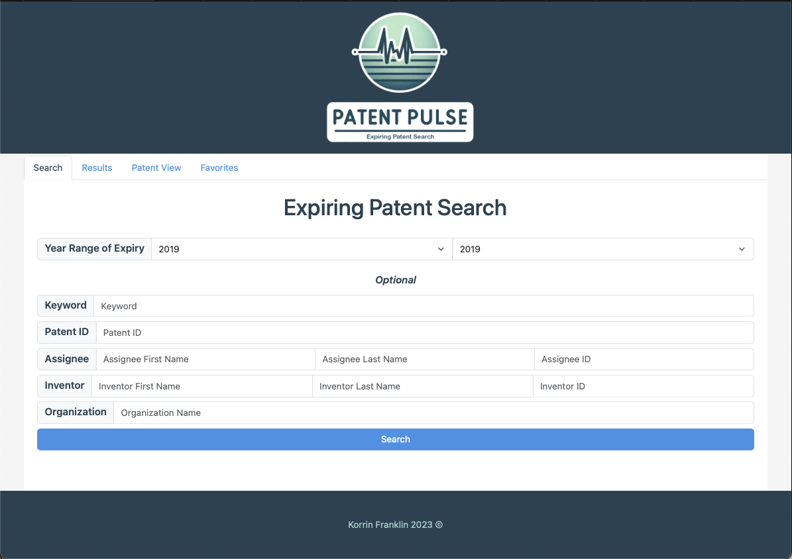
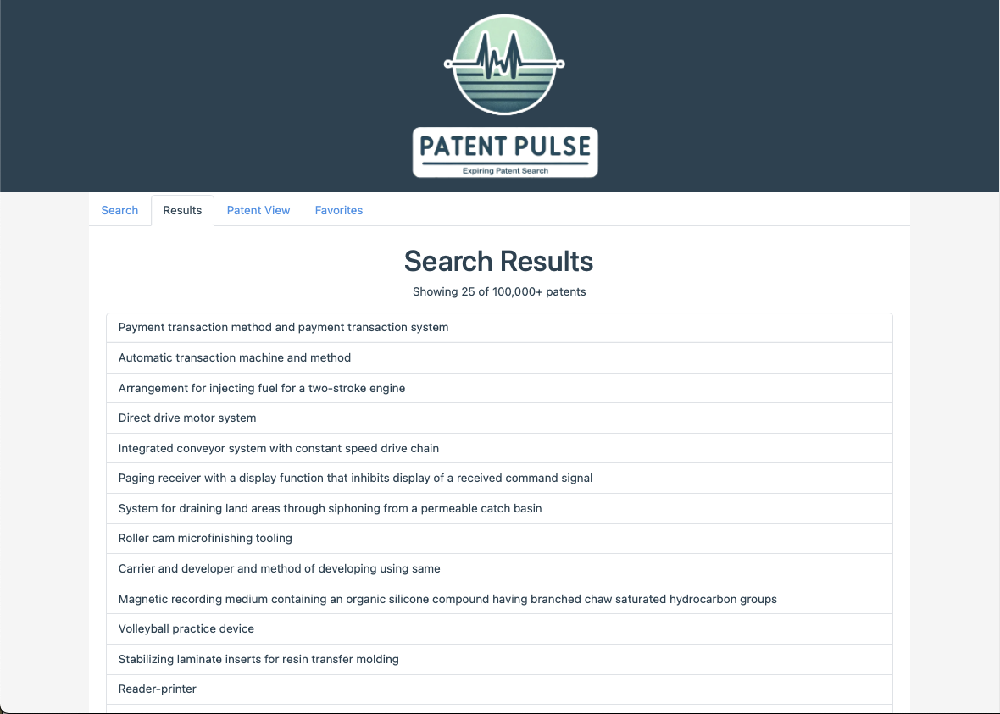
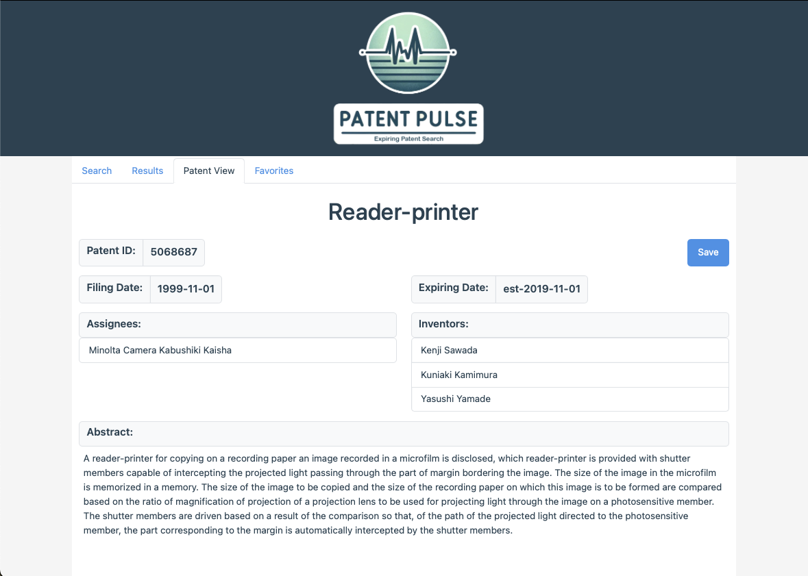
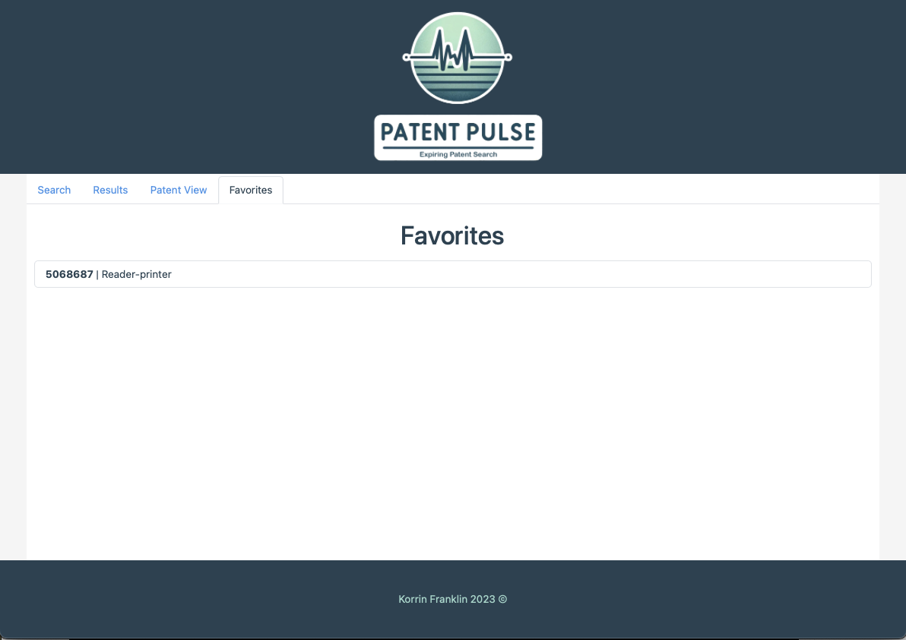

# Patent Pulse

## Description 

Your expiring patent search tool. I have had an interest in patents for a while now particularly in technologies that may soon become available to the public. When this happens there can be huge changes and advancements in certain industries. Some well know examples of this include 3D-Printing and Drones. I soon realised that it wasnt possible to search for expiring patents specifically through any of the online databases so this project is an attempt to provide a simple tool to do so. 

## Installation

No installation required. Just head over to the deployed app. Some upcoming features may require your API keys to function.

## Usage 
Visit the deployed app here: [Patent Pulse](https://korrin-f.github.io/expiring-patent-search/)

1) Enter your search criteria into the landing page search form. Start with a year range and then refine your results from there. 

2) After a moment the results will load and be displayed in the results tab. From here you can see patents and patend ID information. 

3) Click on any patent and more details will be displayed on the patent view tab. You can go back to the search results tab and click any other patent at any time up until you run a new search.

4) If you are interested in a patent then click the save button. This will save the patent to your local storage. View your saves on the favorites tab at any time. Click on any favorite to be taken back to the patents view tab loaded with the new patent information.

## License

See licence in repo.

## Badges

